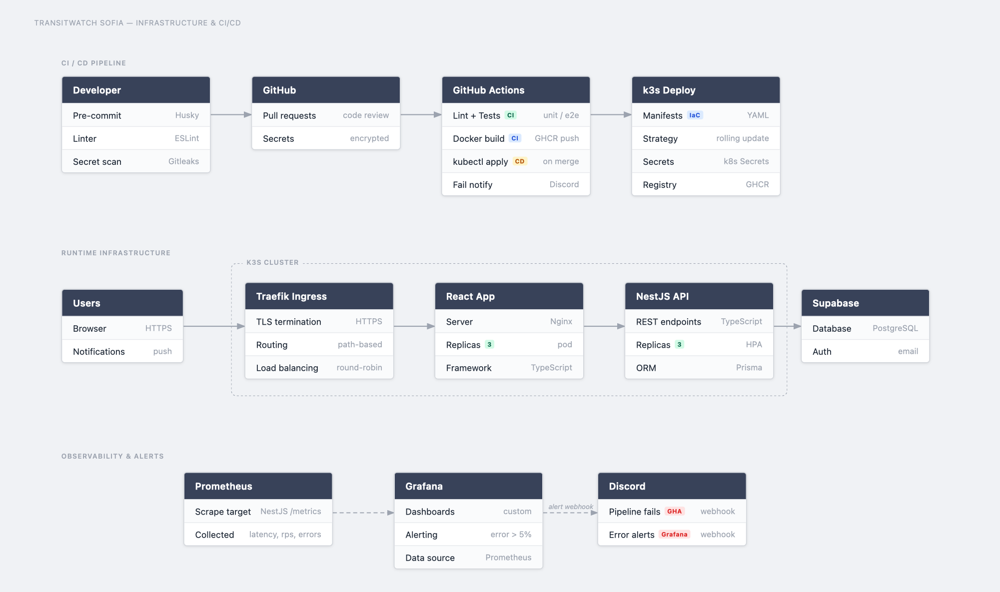
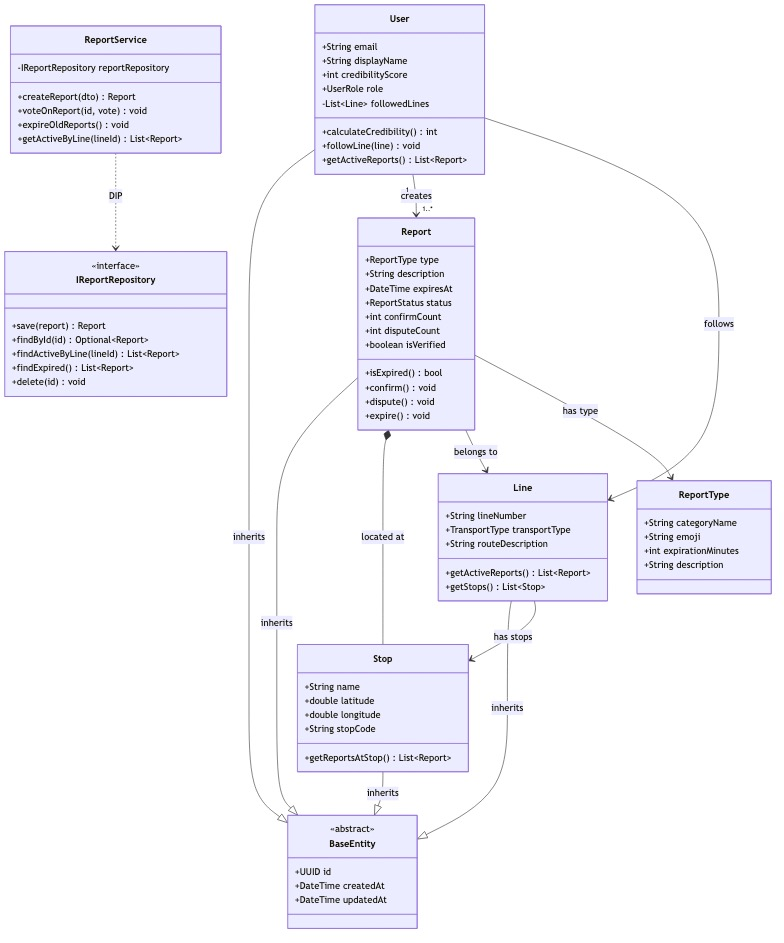

# TransitWatch Sofia 

> **Work in Progress** — Development ongoing for ПБО (School Project) 2025–2026

Real-time crowdsourced reporting for Sofia's public transit. Report issues, verify them, and help other passengers stay informed before boarding.

**Think Waze, but for buses, trams, and the metro.**

## What is it?

TransitWatch is a web app where Sofia transit users can:
- **Report problems** — broken AC, delays, overcrowding, inspectors, safety issues
- **See reports in real-time** on an interactive map
- **Verify or dispute** reports from other users
- **Follow favorite lines** and get notified about verified issues

Reports auto-expire based on category, and the community decides what's real through voting.

### Why TransitWatch?

| Solution | What it offers | What's missing |
|---|---|---|
| CGM (City Mobility Center) | Official complaint channel | Takes days, doesn't reach other passengers |
| Google Maps / Moovit | Schedules, routes, GPS delays | No real-time crowdsourced reports |
| Facebook groups / Twitter | People share problems sometimes | No structure, no map, slow |
| **TransitWatch** ✓ | **Real-time peer reports, map, voting, auto-expire** | **Solves all of the above** |

## Local Development (Docker)

Start the full stack with a single command:

```bash
# 1. Copy environment variables
cp .env.example .env

# 2. Start all services
docker-compose up
```

This spins up:
- **API** at http://localhost:3000 (NestJS)
- **Frontend** at http://localhost:5173 (React + Vite with hot reload)
- **Postgres** at localhost:5432 (data persists via Docker volume)

Health check: http://localhost:3000/health

To rebuild after dependency changes:
```bash
docker-compose up --build
```

To reset the database:
```bash
docker-compose down -v
```

## Tech Stack

| Layer | Tech |
|---|---|
| **Frontend** | React + TypeScript, Leaflet maps |
| **Backend** | NestJS + TypeScript |
| **Database** | Supabase (PostgreSQL) |
| **Auth** | Supabase Email Auth |
| **Infrastructure** | Docker, GitHub Actions CI/CD |

## System Architecture

The app follows a **layered architecture** with clear separation of concerns:

```
User (Browser)
    ↓ HTTPS
    ├→ Cloudflare CDN
    ├→ React App (Frontend)
         ↓ REST API
    ├→ NestJS API (Backend)
         ↓ Database / ORM
    └→ Supabase PostgreSQL
```



**Key layers:**
- **Frontend** — React + TypeScript, Leaflet interactive map
- **Backend** — NestJS REST API with service/repository pattern
- **Database** — PostgreSQL (Supabase) with Prisma ORM
- **Observability** — Prometheus metrics, GitHub Actions CI/CD

## Domain Model (UML)

The core entities and their relationships:



**Key classes:**
- **User** — email authentication (Supabase), credibility score, followed lines
- **Report** — linked to user, line, stop; has type, description, expiry time
- **Line** — bus/tram/metro line with stops
- **Stop** — geographic location (lat/lng) on a line
- **ReportType** — category (vehicle, traffic, inspectors, safety, other)
- **BaseEntity** — abstract base (id, createdAt, updatedAt)

## Key Concepts

### Report Categories & Auto-Expiry
| Type | Examples | Expires |
|---|---|---|
| **Vehicle** | Broken AC, door, loud noise | 60 min |
| **Traffic** | Delay >10min, overcrowding | 30 min |
| **Inspectors** | Ticket check at stop X | 20 min |
| **Safety/Comfort** | Aggressive passenger, dark lighting | 45 min |
| **Other** | Free seats, route change | 30 min |

### Credibility & Verification
- **Credibility Score** — Users earn points from verified reports (shown first in feeds)
- **Verification** — 3+ confirmations → marked as Verified
- **Auto-hide** — 3+ disputes → automatically hidden & sent to moderation queue
- **No anonymous reports** — account required (reduces spam)

---

**Team:** Zlaten Vek (Златен Век)
**School:** ТУЕС Sofia, 11. Grade
**Subject:** ПБО (Programming & Software Development) 2025–2026