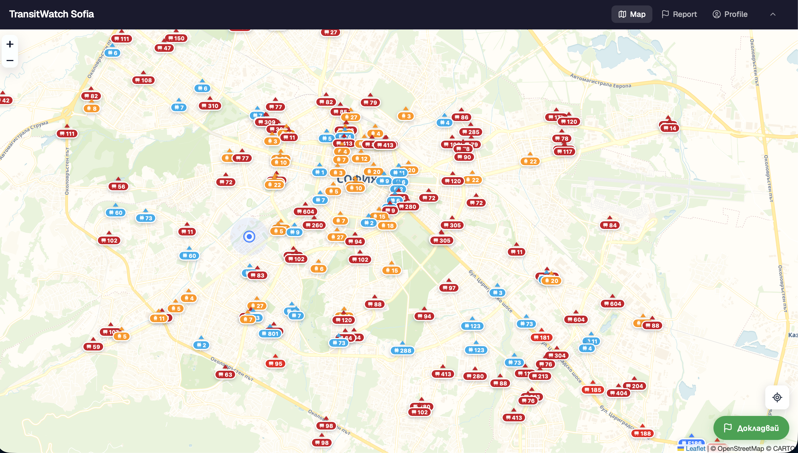
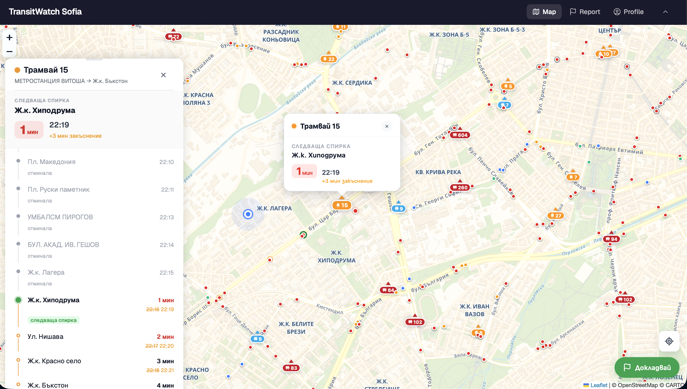
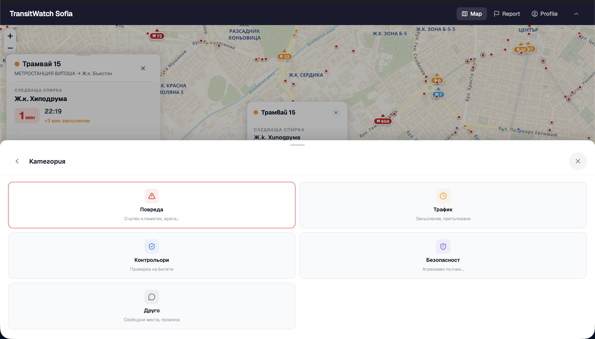
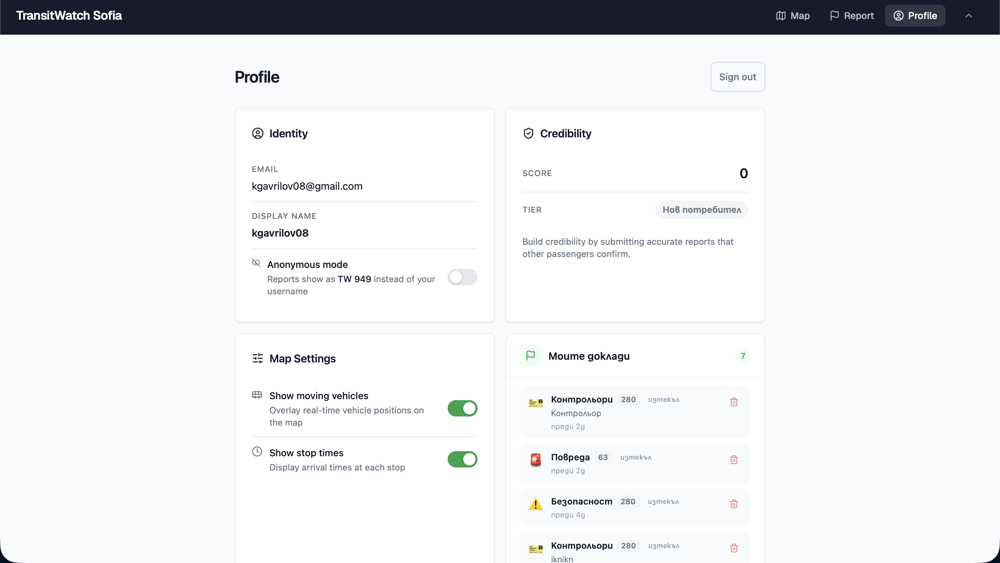

# TransitWatch Sofia — Документация

**Екип: Златен Век**

React • NestJS • PostgreSQL • Docker • Kubernetes • ArgoCD

---

## Съдържание

- [1. Анализ и проучване](#1-анализ-и-проучване)
  - [1.1 Предметна област и целева аудитория](#11-предметна-област-и-целева-аудитория)
  - [1.2 Преглед на съществуващи решения](#12-преглед-на-съществуващи-решения)
  - [1.3 Аргументация за избор на технологии](#13-аргументация-за-избор-на-технологии)
- [2. Проектиране](#2-проектиране)
  - [2.1 Функционални изисквания](#21-функционални-изисквания)
  - [2.2 Архитектура на системата](#22-архитектура-на-системата)
  - [2.3 Инфраструктурна диаграма](#23-инфраструктурна-диаграма)
  - [2.4 Схема на базата данни](#24-схема-на-базата-данни)
  - [2.5 UML Class диаграма](#25-uml-class-диаграма)
- [3. Реализация](#3-реализация)
  - [3.1 Файлова структура](#31-файлова-структура)
  - [3.2 Сървърна част — API](#32-сървърна-част--api)
  - [3.3 Клиентска част — React](#33-клиентска-част--react)
  - [3.4 База данни — модели и заявки](#34-база-данни--модели-и-заявки)
  - [3.5 Тестване](#35-тестване)
- [4. Инфраструктура](#4-инфраструктура)
  - [4.1 Docker конфигурация](#41-docker-конфигурация)
  - [4.2 CI/CD Pipeline](#42-cicd-pipeline)
  - [4.3 Kubernetes и ArgoCD](#43-kubernetes-и-argocd)
  - [4.4 Инструкции за стартиране](#44-инструкции-за-стартиране)
- [5. Екранни снимки](#5-екранни-снимки)
- [6. AI Инструменти](#6-ai-инструменти)
- [Заключение](#заключение)
- [Източници](#източници)
- [Приложения](#приложения)

---

## Увод

Градският транспорт на София обслужва над 1.3 милиона души дневно чрез автобусни, трамвайни, тролейбусни и метро линии, управлявани от Софисйки Градски Транспорт (СГТ) и Метрополитен ЕАД. Въпреки мащаба на мрежата, пътуващите разполагат с ограничени инструменти за реална обратна връзка. Съществуващите канали за сигнали са насочени към администрацията, а не към останалите пътници, което означава, че критична ситуационна информация — повреди, контрольори, претовареност — остава затворена в бюрократични процеси вместо да достигне до тези, на които е нужна в момента.

TransitWatch Sofia адресира точно тази празнина: вместо да изпраща сигнали към Центъра за градска мобилност, информацията тече директно между пътниците в реално време. Моделът е crowdsourced — потребителите докладват, потвърждават или оспорват ситуации, като верифицираните репорти се показват на интерактивна карта. Приложението интегрира и официални GTFS данни от Столична агенция за транспорт — реален GPS на превозните средства и разписания на спирките, което дава на пътниците пълна картина преди да се качат.

Проектът е разработен от екип **Златен Век** като ученически проект в ТУЕС (Технологично училище „Електронни системи"), 11. клас по предмет Единен проект за 11-ти клас".

---

## 1. Анализ и проучване

### 1.1 Предметна област и целева аудитория

Градският транспорт на София обслужва над 1.3 милиона души дневно чрез автобусни, трамвайни, тролейбусни и метро линии, управлявани от Столичен градски транспорт (СГТ) и Метрополитен ЕАД. Въпреки мащаба на мрежата, пътуващите разполагат с ограничени инструменти за реална обратна връзка. Съществуващите канали за сигнали са насочени към администрацията, а не към останалите пътници, което означава, че критична ситуационна информация (повреди, контрольори, претовареност) остава затворена в бюрократични процеси вместо да достигне до тези, на които е нужна в момента.

TransitWatch Sofia адресира точно тази празнина: вместо да изпраща сигнали към Центъра за градска мобилност, информацията тече директно между пътниците в реално време. Моделът е crowdsourced — потребителите докладват, потвърждават или оспорват ситуации, като верифицираните репорти се показват на интерактивна карта.

| Сегмент | Описание | Ключова нужда |
|:--------|:---------|:-------------|
| Ежедневни пътници | Хора, използващи градски транспорт за работа/училище | Навременна информация преди качване |
| Студенти и ученици | Голяма група, зависима от обществен транспорт | Известия за контрольори, закъснения |
| Туристи | Посетители без познания за системата | Карта с проблеми на разбираем език |
| Активни граждани | Хора, желаещи да подобрят транспорта | Статистика, данни за системни проблеми |

*Таблица 1: Целева аудитория*

### 1.2 Преглед на съществуващи решения

За да обосновем необходимостта от TransitWatch, разглеждаме три вече съществуващи решения, които покриват части от проблемното пространство, но не решават изцяло нуждата от peer-to-peer реално-времева комуникация между пътниците.

#### 1.2.1 Център за градска мобилност (ЦГМ) — Система за сигнали

ЦГМ предоставя официален канал за подаване на сигнали за проблеми в градския транспорт на София. Потребителите могат да изпращат жалби чрез уеб формуляр, телефон или приложение. Сигналите се обработват от администрацията и се препращат към съответните отговорни лица.

| Аспект | Положително | Отрицателно |
|:-------|:------------|:------------|
| Обхват | Официален и легитимен канал с институционална тежест | Информацията не достига до другите пътуващи |
| Скорост | Централизирана обработка | Време за реакция от часове до дни; не е real-time |
| Данни | Събира статистика за системни проблеми | Няма карта, няма интерактивност за крайния потребител |
| Достъпност | Безплатно | Липсва мобилно-оптимизиран интерфейс |

*Таблица 2: ЦГМ — Система за сигнали*

#### 1.2.2 Moovit / Google Maps

Moovit и Google Maps са глобални платформи за навигация в обществен транспорт. Те предлагат маршрутизация, разписания и в определени случаи — данни за закъснения, извлечени от GPS проследяване на превозни средства.

| Аспект | Положително | Отрицателно |
|:-------|:------------|:------------|
| Маршрутизация | Изключително точна навигация | Не показва ситуационни проблеми |
| Данни за закъснения | GPS-базирани закъснения в реално време | Няма crowdsourced репорти от пътниците |
| UX / Интерфейс | Полиран, професионален, многоезичен | Фокус върху маршрут, не върху състоянието |
| Общност | Голяма потребителска база | Няма peer-to-peer комуникация |

*Таблица 3: Moovit / Google Maps*

#### 1.2.3 Facebook групи и социални мрежи

Неформални канали като Facebook групи ("Градски транспорт София") и Twitter/X служат като ad hoc платформа за споделяне на проблеми. Потребителите публикуват снимки, коментари и жалби.

| Аспект | Положително | Отрицателно |
|:-------|:------------|:------------|
| Достъпност | Безплатно, голям reach | Липсва структура; информацията се губи |
| Скорост | Публикуване в реално време | — |
| Данни | Снимки и контекст от място | Няма карта, няма геолокация |
| Достоверност | Коментари и реакции като валидация | Няма системно гласуване или credibility |

*Таблица 4: Facebook групи и социални мрежи*

#### Обобщение — Сравнителна матрица

| Критерий | ЦГМ | Moovit / GMaps | Facebook | TransitWatch |
|:---------|:----|:---------------|:---------|:-------------|
| Real-time данни | Не | Частично (GPS) | Частично | Да |
| Crowdsourced репорти | Не | Не | Неструктурирано | Да |
| Интерактивна карта | Не | Да (маршрути) | Не | Да (репорти) |
| Гласуване | Не | Не | Реакции (слабо) | Да |
| Авто. изтичане | Не | N/A | Не | Да |
| Credibility | Не | Не | Не | Да |
| Реални GPS позиции | Не | Да | Не | Да (GTFS-RT) |
| Разписания на спирки | Не | Да | Не | Да (GTFS) |

*Таблица 5: Сравнителна матрица*

### 1.3 Аргументация за избор на технологии

Изборът на технологичен стек е продиктуван от няколко фактора: изискванията на заданието (API, бази данни, визуализация), спецификата на проекта (real-time, карти, уеб), опита на екипа и екосистемната зрялост на инструментите.

| Слой | Технология | Аргументация |
|:-----|:-----------|:-------------|
| Frontend | React 19 + TypeScript | Компонентна архитектура, богата екосистема, TypeScript за type safety. Leaflet за интерактивни карти. |
| Backend | NestJS 11 + TypeScript | Модулна архитектура с вграден DI контейнер. Layered architecture по дизайн. Интеграция с Prisma и Prometheus. |
| База данни | Supabase (PostgreSQL) | Релационна БД за силни връзки. ACID транзакции. Auth, RLS, managed hosting. Безплатен tier. |
| ORM | Prisma 7 | Type-safe заявки, автоматични миграции, интроспекция на схема. |
| Аутентикация | Supabase Auth | Email регистрация с верификация. JWT токени. Интеграция с JWKS за валидация в API. |
| Реален транспорт | GTFS-RT (Protocol Buffers) | Официален отворен стандарт за транзитни данни. Данни от Столична агенция за транспорт. |
| CI/CD | GitHub Actions | Native интеграция с GitHub repo. YAML-базирани pipelines. |
| Контейнеризация | Docker | Изолирани контейнери. Единна среда за dev и production. |
| Оркестрация | Kubernetes (k3s) | Индустриален стандарт. Container orchestration. HPA за автоматично скалиране. |
| GitOps | ArgoCD | Автоматично синхронизиране на K8s манифести от Git. Декларативна инфраструктура. |
| Мониторинг | Prometheus + Alertmanager | Open-source метрики. Нативна интеграция с NestJS. Алерти в Discord. |
| Secrets | GitHub + k8s Secrets | GitHub Secrets за CI/CD. k8s Secrets за production. Gitleaks pre-commit. |

*Таблица 6: Избор на технологии*

**Ключово решение: PostgreSQL vs. NoSQL.** Избираме релационна база данни, защото домейн моделът има силни релации (потребител създава репорт, репортът е свързан с линия и спирка, гласовете са свързани с репорт и потребител). Необходими са ни ACID транзакции при гласуване (за да се избегнат race conditions при едновременни потвърждения/оспорвания). PostgreSQL поддържа и геопространствени заявки чрез PostGIS разширението, което е от значение при работа с координати на спирки.

**Ключово решение: GTFS интеграция.** Sofia Traffic предоставя официален GTFS feed (статичен и real-time), което позволява импортиране на реалните линии, спирки и маршрути без ръчно въвеждане на данни. Real-time feed предоставя GPS позиции на превозните средства на всеки 10–15 секунди чрез Protocol Buffers формат.

---

## 2. Проектиране

### 2.1 Функционални изисквания

Функционалните изисквания описват конкретните действия, които системата трябва да поддържа. Те са организирани по модули.

#### FR-1: Аутентикация и потребителски профил

| ID | Изискване | Приоритет |
|:---|:---------|:---------|
| FR-1.1 | Потребителят може да се регистрира с email и парола чрез Supabase Auth | Висок |
| FR-1.2 | Потребителят може да влезе в системата с email и парола | Висок |
| FR-1.3 | Системата издава JWT токен при успешна аутентикация | Висок |
| FR-1.4 | Всеки потребител има credibility score, който се съхранява в базата | Нисък |

*Таблица 7: Функционални изисквания: Аутентикация*

#### FR-2: Управление на репорти

| ID | Изискване | Приоритет |
|:---|:---------|:---------|
| FR-2.1 | Аутентикиран потребител може да създаде репорт за конкретна линия (POST /reports) | Висок |
| FR-2.2 | Репортът съдържа: линия (lineId), категория, описание (до 140 символа), опционален vehicleId | Висок |
| FR-2.3 | Системата изчислява expiresAt на база категорията (Strategy pattern) | Висок |
| FR-2.4 | Всеки потребител може да вижда всички активни репорти (GET /reports/active) | Висок |
| FR-2.5 | Потребителят може да филтрира репорти по линия (GET /reports/line/:lineId) | Среден |
| FR-2.6 | Потребителят може да вижда детайли за конкретен репорт (GET /reports/:id) | Среден |
| FR-2.7 | Собственикът на репорт може да го изтрие (DELETE /reports/:id) | Среден |

*Таблица 8: Функционални изисквания: Репорти*

#### FR-3: Гласуване и верификация

| ID | Изискване | Приоритет |
|:---|:---------|:---------|
| FR-3.1 | Аутентикиран потребител може да потвърди (confirm) или оспори (dispute) репорт | Среден |
| FR-3.2 | Всеки потребител може да гласува само веднъж за даден репорт (unique constraint) | Среден |
| FR-3.3 | Credibility score на репорта се актуализира при ново гласуване | Нисък |

*Таблица 9: Функционални изисквания: Гласуване*

#### FR-4: Автоматично изтичане на репорти

| ID | Изискване | Приоритет |
|:---|:---------|:---------|
| FR-4.1 | Cron job проверява на всеки 5 минути за изтекли репорти | Висок |
| FR-4.2 | Изтеклите репорти автоматично се маркират със статус expired | Висок |
| FR-4.3 | Времето за изтичане е различно за всяка категория | Висок |

*Таблица 10: Функционални изисквания: Изтичане*

#### FR-5: Интерактивна карта

| ID | Изискване | Приоритет |
|:---|:---------|:---------|
| FR-5.1 | Началната страница показва карта на София с маркери за активни репорти | Висок |
| FR-5.2 | При натискане на маркер се показват детайли за репорта | Среден |
| FR-5.3 | Картата използва Leaflet с CARTO tiles| Висок |
| FR-5.4 | Картата показва всички спирки в текущия viewport | Висок |
| FR-5.5 | Картата показва реални GPS позиции на превозните средства | Висок |

*Таблица 11: Функционални изисквания: Карта*

#### FR-6: GTFS интеграция

| ID | Изискване | Приоритет |
|:---|:---------|:---------|
| FR-6.1 | Системата импортира линии, спирки и маршрути от Sofia Traffic GTFS feed | Висок |
| FR-6.2 | Реалните GPS позиции на превозните средства се опресняват на всеки 10 секунди | Висок |
| FR-6.3 | Предстоящите пристигания на дадена спирка се изчисляват от GTFS-RT данните | Среден |

*Таблица 12: Функционални изисквания: GTFS*

### 2.2 Архитектура на системата

TransitWatch Sofia използва Layered Architecture (многослойна архитектура), при която всеки слой има ясно дефинирана отговорност и комуникира само с съседния слой. Това осигурява separation of concerns, testability и възможност за независима промяна на всеки слой.

| Слой | Технология | Отговорност |
|:-----|:-----------|:------------|
| Presentation Layer | React 19 + TypeScript, Leaflet | Потребителски интерфейс, интерактивна карта, форми за репорти |
| API Layer | NestJS Controllers | HTTP endpoints, валидация, маршрутизация на заявки |
| Service Layer | NestJS Services | Бизнес логика: валидация, credibility, изтичане, GTFS |
| Repository Layer | Prisma + IRepository | Абстракция над БД. Repository Pattern. |
| Data Layer | Supabase (PostgreSQL) | Съхранение на данни, миграции, RLS |

*Таблица 13: Архитектура на системата*

Потокът на данните е следният: потребителят взаимодейства с React приложението, което изпраща REST API заявки към NestJS backend-а. Controller-ът делегира на Service класа, който съдържа бизнес логиката. Service класът работи с Repository интерфейс (DIP принцип), а конкретната имплементация използва Prisma за достъп до PostgreSQL базата.

#### NestJS Модулна структура

| Модул | Компоненти | Описание |
|:------|:----------|:---------|
| AuthModule | AuthController, AuthService, JwtStrategy | Регистрация, вход, JWT валидация (JWKS) |
| ReportModule | ReportController, ReportService, IReportRepository, ReportExpiryJobService | CRUD за репорти, гласуване, изтичане |
| VoteModule | VoteController, VoteService, IVoteRepository | Cast confirm/dispute гласове |
| LineModule | LineController, LineService, LineRepository | Линии, спирки, свързани репорти |
| TransitModule | TransitController, GtfsStaticService, GtfsRealtimeService, StopArrivalService | GTFS импорт, реално GPS, пристигания |
| UserModule | UserController, UserService, UserRepository | Профили, credibility score |
| MetricsModule | MetricsController, HttpMetricsInterceptor | Prometheus метрики, HTTP interceptor |
| PrismaModule | PrismaService | Глобален database client |

*Таблица 14: NestJS модулна структура*

#### Design Patterns

| Pattern | Където | Какъв проблем решава |
|:--------|:-------|:--------------------|
| Repository Pattern | IReportRepository, IVoteRepository, IUserRepository | Абстракция на достъпа до БД. Позволява смяна на ORM без промяна на бизнес логиката. Тествано с mock repositories. |
| Strategy Pattern | Типове репорти (enum + strategy) | Добавяне на нови категории без промяна на съществуващ код (OCP). Всяка категория дефинира собствено изтичане. |
| Dependency Injection | Целият NestJS | Loose coupling, тестируемост, модулност |

*Таблица 15: Design Patterns*

### 2.3 Инфраструктурна диаграма

Инфраструктурната диаграма илюстрира пълния път на заявката от потребителя до базата данни, включително CI/CD pipeline-а, GitOps с ArgoCD и мониторинг с Prometheus. Потребителят достига системата чрез Traefik Ingress, който маршрутизира трафика към React frontend или NestJS API. API слоят комуникира с Supabase PostgreSQL за съхранение на данни, с GTFS feeds от Sofia Traffic за реални транзитни данни, и с Prometheus за метрики. Паралелно, всеки push към GitHub минава през CI/CD pipeline (lint → тестове → Docker build → push към GHCR), а ArgoCD автоматично синхронизира K8s манифестите при промяна.

> **[ДИАГРАМА 1 — Инфраструктурна диаграма]**
>
> *Виж инструкциите за диаграми в края на документа.*

*Фигура 1: Инфраструктурна диаграма*

#### Описание на компонентите

| Компонент | Описание | Конфигурация |
|:----------|:---------|:-------------|
| Traefik Ingress | Reverse proxy и load balancer | Вграден в k3s |
| Web Deployment | React SPA, сервирана от Nginx | 2 replicas, port 80 |
| API Deployment | NestJS REST API сървър | 3 replicas, HPA (3-10), port 3000 |
| Prometheus | Събира метрики от API pods | Alerting при error rate > 5% |
| Alertmanager | Изпраща алерти | Discord Webhook |
| ArgoCD | GitOps контролер | Auto-sync от `k8s/` директория в main branch |
| GitHub Actions | CI/CD pipeline: lint → test → build → deploy | Trigger: push to main, PR |
| GHCR | Docker image registry | GitHub Container Registry |
| Supabase | PostgreSQL + Auth | Managed hosting |
| Sofia Traffic GTFS | Официален транзитен feed | Статичен + Realtime (Protocol Buffers) |

*Таблица 16: Компоненти на инфраструктурата*

### 2.4 Схема на базата данни

Базата данни използва PostgreSQL чрез Supabase и е моделирана с Prisma ORM. Схемата съдържа 7 таблици с ясно дефинирани връзки. Базата е нормализирана до 3NF. Всяка таблица съдържа само атрибути, зависещи директно от първичния ключ.

> **[ДИАГРАМА 2 — ER диаграма]**
>
> *Виж инструкциите за диаграми в края на документа.*

*Фигура 2: Схема на базата данни (ER диаграма)*

**Таблица users** — Регистрирани потребители

| Колона | Тип | Ограничения | Описание |
|:-------|:----|:-----------|:---------|
| id | UUID | PK | Уникален идентификатор (от Supabase Auth) |
| email | TEXT | UNIQUE, NOT NULL | Email адрес на потребителя |
| credibilityScore | INT | DEFAULT 0 | Рейтинг на достоверност |
| createdAt | TIMESTAMP | DEFAULT now() | Дата на регистрация |

*Таблица 17: Таблица users*

**Таблица reports** — Потребителски репорти за проблеми

| Колона | Тип | Ограничения | Описание |
|:-------|:----|:-----------|:---------|
| id | UUID | PK | Уникален идентификатор |
| userId | UUID | FK → users | Автор на репорта |
| lineId | UUID | FK → lines | Линия, за която е репортът |
| vehicleId | VARCHAR | NULLABLE | Опционален ID на превозното средство |
| category | VARCHAR | NOT NULL | Категория (VEHICLE\_ISSUE, TRAFFIC, INSPECTORS, SAFETY, OTHER) |
| description | VARCHAR | max 140, NULLABLE | Кратко описание на проблема |
| photoUrl | VARCHAR | NULLABLE | URL на снимка (опционален) |
| credibilityScore | INT | DEFAULT 5 | Текущ рейтинг на репорта |
| expiresAt | TIMESTAMP | NOT NULL | Кога изтича автоматично (Strategy) |
| status | VARCHAR | DEFAULT 'active' | Статус на репорта |
| createdAt | TIMESTAMP | DEFAULT now() | Дата на създаване |

*Таблица 18: Таблица reports*

**Таблица votes** — Гласове за потвърждение/оспорване на репорти

| Колона | Тип | Ограничения | Описание |
|:-------|:----|:-----------|:---------|
| id | UUID | PK | Уникален идентификатор |
| reportId | UUID | FK → reports | Репорт, за който е гласът |
| userId | UUID | FK → users | Потребител, който гласува |
| type | VARCHAR | NOT NULL | Вид глас: confirm или dispute |
| — | — | UNIQUE(reportId, userId) | Един потребител - един глас на репорт |

*Таблица 19: Таблица votes*

**Таблица lines** — Линии на градския транспорт

| Колона | Тип | Ограничения | Описание |
|:-------|:----|:-----------|:---------|
| id | UUID | PK | Уникален идентификатор |
| gtfsId | VARCHAR | UNIQUE, NULLABLE | GTFS route\_id (от Sofia Traffic) |
| name | VARCHAR | NOT NULL | Наименование/номер на линията (напр. „23", „5") |
| type | VARCHAR | NOT NULL | Вид транспорт: bus, tram, metro, trolley |
| color | VARCHAR | NULLABLE | Цвят на линията (hex без #) |

*Таблица 20: Таблица lines*

**Таблица stops** — Спирки на градския транспорт

| Колона | Тип | Ограничения | Описание |
|:-------|:----|:-----------|:---------|
| id | UUID | PK | Уникален идентификатор |
| gtfsId | VARCHAR | UNIQUE, NULLABLE | GTFS stop\_id (от Sofia Traffic) |
| stopCode | VARCHAR | NULLABLE | GTFS stop\_code |
| name | VARCHAR | NOT NULL | Наименование на спирката |
| lat | FLOAT | NOT NULL | Географска ширина |
| lng | FLOAT | NOT NULL | Географска дължина |

*Таблица 21: Таблица stops*

**Таблица line\_stops** — Спирките на всяка линия (M:N връзка)

| Колона | Тип | Ограничения | Описание |
|:-------|:----|:-----------|:---------|
| id | UUID | PK | Уникален идентификатор |
| lineId | UUID | FK → lines | Линия |
| stopId | UUID | FK → stops | Спирка |
| stopOrder | INT | NOT NULL | Пореден номер на спирката по линията |

*Таблица 22: Таблица line\_stops*

**Таблица shapes** — Геометрия на маршрутите

| Колона | Тип | Ограничения | Описание |
|:-------|:----|:-----------|:---------|
| id | UUID | PK | Уникален идентификатор |
| lineId | UUID | UNIQUE FK → lines | Линия |
| coordinates | JSON | NOT NULL | Масив от [lat, lng] точки (опростен с RDP алгоритъм) |

*Таблица 23: Таблица shapes*

#### Връзки между таблиците

| Връзка | Тип | Описание |
|:-------|:----|:---------|
| users → reports | 1:N | Потребител създава много репорти |
| users → votes | 1:N | Потребител подава много гласове |
| lines → line\_stops | 1:N | Линия има много записи в line\_stops |
| stops → line\_stops | 1:N | Спирка присъства в много линии чрез line\_stops |
| lines → stops | M:M | Много-към-много чрез line\_stops |
| lines → reports | 1:N | Линия може да има много репорти |
| reports → votes | 1:N | Репорт може да има много гласове |
| lines → shapes | 1:1 | Линия има един маршрут (геометрия) |

*Таблица 24: Връзки между таблиците*

### 2.5 UML Class диаграма

Диаграмата демонстрира наследяване (BaseEntity е базов клас за User, Report, Stop, Line, Vote, Shape), композиция (Report съдържа Line), асоциация (User създава Report), и Dependency Inversion (ReportService зависи от IReportRepository интерфейс). Strategy Pattern е представен чрез IReportStrategy интерфейс и отделни стратегии за всяка категория репорт.

> **[ДИАГРАМА 3 — UML Class диаграма]**
>
> *Виж инструкциите за диаграми в края на документа.*

*Фигура 3: UML Class диаграма*

---

## 3. Реализация

### 3.1 Файлова структура

Проектът е организиран като **монорепо** с npm workspaces, съдържащо три основни пакета: backend API, frontend React приложение и споделен пакет с типове.

```
Zlaten-Vek-TransitWatch/
├── apps/
│   ├── api/                        # NestJS backend
│   │   ├── src/
│   │   │   ├── auth/               # JWT аутентикация
│   │   │   ├── report/             # Репорти + Strategy Pattern
│   │   │   ├── vote/               # Гласуване
│   │   │   ├── line/               # Линии
│   │   │   ├── transit/            # GTFS интеграция
│   │   │   ├── user/               # Потребителски профил
│   │   │   ├── metrics/            # Prometheus метрики
│   │   │   └── prisma/             # Database service
│   │   ├── prisma/
│   │   │   ├── schema.prisma       # Схема на БД
│   │   │   └── migrations/         # История на миграциите
│   │   └── Dockerfile
│   │
│   └── web/                        # React + Vite frontend
│       ├── src/
│       │   ├── components/         # UI компоненти (map, panels)
│       │   ├── pages/              # Маршрутни страници
│       │   ├── hooks/              # Custom React hooks
│       │   ├── contexts/           # Auth context
│       │   └── lib/                # API client, utils
│       └── Dockerfile
│
├── packages/
│   └── shared/                     # Споделени типове и DTOs
│       └── src/
│           ├── dto/                # CreateReportDto, ReportResponseDto
│           └── enums/              # ReportCategory, VoteType, ReportStatus
│
├── k8s/                            # Kubernetes манифести
├── argocd/                         # ArgoCD конфигурация
├── .github/workflows/              # CI/CD pipelines
├── docker-compose.yml              # Локална разработка
└── package.json                    # Workspace root
```

*Листинг 1: Файлова структура на проекта*

### 3.2 Сървърна част — API

#### API Endpoints

**Аутентикация:**

| Метод | Път | Auth | Описание |
|:------|:----|:-----|:---------|
| GET | `/auth/me` | Bearer JWT | Вземи/създай потребителски профил |

**Репорти:**

| Метод | Път | Auth | Описание |
|:------|:----|:-----|:---------|
| POST | `/reports` | Bearer JWT | Създай репорт |
| GET | `/reports/active` | — | Вземи всички активни репорти |
| GET | `/reports/mine` | Bearer JWT | Вземи репортите на потребителя |
| GET | `/reports/:id` | — | Вземи конкретен репорт |
| GET | `/reports/line/:lineId` | — | Вземи репортите за линия |
| DELETE | `/reports/:id` | Bearer JWT | Изтрий репорт (само собственик) |

**Гласуване:**

| Метод | Път | Auth | Описание |
|:------|:----|:-----|:---------|
| POST | `/reports/:reportId/votes` | Bearer JWT | Гласувай (confirm/dispute) |
| GET | `/reports/:reportId/votes` | Опционален | Вземи броя гласове + гласа на потребителя |

**Линии:**

| Метод | Път | Auth | Описание |
|:------|:----|:-----|:---------|
| GET | `/lines` | — | Вземи всички линии |
| GET | `/lines/:id` | — | Вземи линия + спирки |
| GET | `/lines/:id/reports` | — | Активни репорти за линия |

**Транзит (GTFS):**

| Метод | Път | Auth | Описание |
|:------|:----|:-----|:---------|
| GET | `/transit/stops` | — | Спирки в bbox (viewport) |
| GET | `/transit/stops/:id` | — | Детайли за спирка |
| GET | `/transit/stops/:id/arrivals` | — | Предстоящи пристигания |
| GET | `/transit/lines` | — | Всички линии (cache 24h) |
| GET | `/transit/lines/:id/shape` | — | Геометрия на маршрута |
| GET | `/transit/vehicles` | — | Реални GPS позиции на МПС |
| GET | `/transit/vehicles/:vehicleId/trip` | — | Маршрут на МПС |
| GET | `/transit/trips/:tripId/timeline` | — | Спирки и ETA по рейс |
| POST | `/transit/import` | — | Ръчен GTFS импорт |

**Потребители и здраве:**

| Метод | Път | Auth | Описание |
|:------|:----|:-----|:---------|
| GET | `/users/me/profile` | Bearer JWT | Профил + credibility score |
| GET | `/health` | — | Health check |
| GET | `/metrics` | — | Prometheus метрики |

*Таблица 25: API Endpoints*

#### Strategy Pattern (Изтичане на репорти)

Всяка категория репорт имплементира интерфейса `IReportStrategy`, който дефинира правилата за изтичане и тежест в credibility изчислението. Новата категория се добавя чрез нов клас, без промяна на съществуващия код (Open/Closed Principle).

| Стратегия | Категория | Изтичане (мин.) |
|:----------|:----------|:----------------|
| VehicleIssueStrategy | VEHICLE\_ISSUE | 60 |
| TrafficStrategy | TRAFFIC | 30 |
| InspectorStrategy | INSPECTORS | 20 |
| SafetyStrategy | SAFETY | 45 |
| OtherStrategy | OTHER | 30 |

*Таблица 26: Report Strategies*

#### GTFS Интеграция

**Статичен импорт (всеки ден в 03:00 UTC):**
- Изтегля официалния GTFS zip от Sofia Traffic
- Парсва CSV файлове: `routes.txt`, `stops.txt`, `stop_times.txt`, `shapes.txt`, `trips.txt`
- Импортира в БД (Line, Stop, LineStop, Shape модели)
- Опростява полилинии с Ramer-Douglas-Peucker алгоритъм (ε=0.0001)
- Импортира само спирки в границите на София (lat 42.5–43.0, lng 23.0–23.6)

**Real-time данни:**
- Изтегля GTFS-RT Protobuf feed на всеки 10 секунди (GPS позиции)
- Изтегля trip updates feed на всеки 15 секунди (предстоящи пристигания)
- Съхранява в памет: `Map<vehicleId, VehiclePosition>`
- Премахва остарели данни (МПС, непреместени > 5 минути)
- Обогатява с метаданни от статичния импорт (наименование, тип, цвят)

#### Prometheus Метрики

| Метрика | Тип | Описание |
|:--------|:----|:---------|
| `http_request_duration_seconds` | Histogram | Латентност на API заявките |
| `http_requests_total` | Counter | Брой заявки по метод/path/статус |
| `reports_created_total` | Counter | Брой създадени репорти по категория |
| `reports_expired_total` | Counter | Брой автоматично изтекли репорти |
| `active_reports_gauge` | Gauge | Текущ брой активни репорти |
| `votes_total` | Counter | Брой гласове по тип |
| `gtfs_import_duration_seconds` | Histogram | Продължителност на GTFS импорт |
| `gtfs_vehicles_tracked` | Gauge | Текущ брой проследявани МПС |

*Таблица 27: Prometheus метрики*

### 3.3 Клиентска част — React

#### Маршрути (Страници)

| Маршрут | Компонент | Описание |
|:--------|:----------|:---------|
| `/` | MapPage | Главен изглед с карта, репорти, МПС, спирки |
| `/login` | LoginPage | Вход чрез Supabase Auth |
| `/register` | RegisterPage | Регистрация чрез Supabase Auth |
| `/profile` | ProfilePage | Потребителски профил, credibility, история |

*Таблица 28: Маршрути (Страници)*

#### Основни компоненти

```
src/components/
├── map/
│   ├── MapController.tsx        # Map instance + bbox логика
│   ├── StopMarkers.tsx          # Спирки на картата
│   ├── StopPopup.tsx            # Детайли за спирка + пристигания
│   ├── VehicleMarkers.tsx       # GPS позиции на МПС
│   ├── VehiclePopup.tsx         # Детайли за МПС + рейс
│   ├── RouteOverlay.tsx         # Полилиния на избрана линия
│   ├── UserLocationMarker.tsx   # GPS позиция на потребителя
│   ├── ReportFAB.tsx            # Бутон за създаване на репорт
│   └── MobileBottomSheet.tsx    # Мобилен bottom panel
├── panels/
│   ├── ArrivalPanel.tsx         # Предстоящи пристигания
│   └── TripTimelinePanel.tsx    # Спирки по рейс с ETA
└── report/
    └── ReportFlow.tsx           # Многостъпков формуляр за репорт
```

*Листинг 2: Основни компоненти*

#### Custom Hooks

| Hook | Описание | Период на опресняване |
|:-----|:---------|:---------------------|
| `useActiveReports` | Активни репорти | 30 секунди |
| `useVehicles` | GPS позиции на МПС | 10 секунди |
| `useStops` | Спирки в текущия viewport | При смяна на bbox |
| `useArrivals` | Пристигания на спирка | При избор |
| `useTripTimeline` | Рейс на МПС | При избор |
| `useLines` | Всички линии | Веднъж |
| `useMyReports` | Репортите на потребителя | Веднъж |
| `useUserLocation` | GPS локация на потребителя | — |

*Таблица 29: Custom Hooks*

#### Поток на автентикация (Frontend)

1. `AuthProvider` инициализира сесията от `supabase.auth.getSession()`
2. Слуша за `onAuthStateChange` събития
3. `useAuth()` hook дава достъп до потребителското състояние
4. Axios interceptor инжектира JWT: `Authorization: Bearer <token>`
5. Токенът се опреснява автоматично при < 60 секунди до изтичане
6. Защитени маршрути проверяват `useAuth().user` преди рендиране

### 3.4 База данни — модели и заявки

Базата данни е PostgreSQL (Supabase), а достъпът до нея е през Prisma ORM. Използваме schema-first подход с миграции, така че всяка промяна по моделите се версионира и може лесно да се проследи между локална, тестова и production среда.

Моделът е релационен: потребители, линии, спирки, репорти и гласове са свързани с външни ключове и ограничения за целостта на данните (например един глас на потребител за даден репорт). Това намалява риска от неконсистентни данни при конкурентни заявки.

Основните заявки са оптимизирани според екрана:
- активни репорти за картата;
- спирки по географски прозорец (bbox);
- детайли по конкретен идентификатор.

### 3.5 Тестване

Тестването е разделено на две части: backend (NestJS + Jest) и frontend (React + Vitest). Използваме автоматични тестове при всяка по-значима промяна и ги пускаме и локално, и в CI pipeline.

#### Как тестваме

- Backend: unit тестове за services, controllers и repository слоевете, плюс e2e тестове за основни HTTP потоци.
- Frontend: un- Backend: 17 test suites, 137 теста (успешни към момента на измерването).
 геолокация, credibility логика и локално съхранение).
- CI: при Pull Request се изпълняват lint + тестове, за да не се вливат промени с регресии.

#### Какви тестове имаме

- Backend: 17 test suites, 137 теста (успешни към момента на измерването).
- Frontend: 5 test suites, 49 теста (успешни към момента на измерването).

#### Как да пуснем тестовете

1. Инсталиране на зависимости (от root): `npm install`
2. Backend unit тестове: `cd apps/api && npm run test`
3. Backend coverage: `cd apps/api && npm run test:cov`
4. Backend e2e: `cd apps/api && npm run test:e2e`
5. Frontend unit тестове: `cd apps/web && npm run test`
6. Frontend coverage: `cd apps/web && npm run test:cov`

---

## 4. Инфраструктура

### 4.1 Docker конфигурация

Проектът има отделни Dockerfile-ове за API и Web. API образът инсталира зависимостите на монорепото, генерира Prisma клиента, компилира TypeScript и стартира NestJS сървъра на порт 3000. Web образът приема Vite environment променливите като build аргументи, компилира React приложението и го сервира на порт 80 чрез `serve`.

За локална разработка `docker-compose.yml` дефинира двата сервиса (`api` и `web`) с нужните environment променливи от `.env` файл — API на `localhost:3000`, Web на `localhost:8080`.

### 4.2 CI/CD Pipeline

#### CI Pipeline (`.github/workflows/ci.yml`)

Задействан при PR и push към `main`:

1. **Secrets Scan (Gitleaks)** — Сканира git история за изложени секрети
2. **Lint** — ESLint на `apps/api` и `apps/web`
3. **Unit Tests** — Jest (API) + Vitest (Web)
4. **Discord Notify** — При провал изпраща известие в Discord

#### CD Pipeline (`.github/workflows/cd.yml`)

Задействан при успешен CI за `main`:

1. **Build Docker Images** — API и Web контейнери
2. **Push to GHCR** — GitHub Container Registry с тагове `<7-char-sha>`
3. **Update Manifests** — Актуализира image тагове в `k8s/*.yaml`
4. **Commit to main** — Записва новите тагове в хранилището
5. **Discord Notify** — Успех или провал

*ArgoCD открива промяната в `k8s/` и автоматично синхронизира.*

### 4.3 Kubernetes и ArgoCD

#### Манифести (`k8s/` директория)

| Файл | Описание |
|:-----|:---------|
| `namespace.yaml` | Namespace `transitwatch` |
| `api-deployment.yaml` | 3+ replicas, port 3000, Prometheus annotations |
| `api-hpa.yaml` | HPA: min 3, max 10 pods, 70% CPU threshold |
| `api-service.yaml` | ClusterIP service за API |
| `web-deployment.yaml` | 2+ replicas, port 80 |
| `web-service.yaml` | ClusterIP service за Web |
| `ingress.yaml` | Traefik IngressRoute (`/api/*` → API, `/*` → Web) |
| `prometheus-config.yaml` | ConfigMap с scrape конфигурация |
| `prometheus-deployment.yaml` | Prometheus pod, port 9090 |
| `prometheus-alert-rules.yaml` | Alert правила (HighApiErrorRate, GTFS грешки) |
| `alertmanager-*.yaml` | Alertmanager + Discord нотификации |

*Таблица 32: Kubernetes манифести*

#### ArgoCD GitOps

ArgoCD е конфигуриран да наблюдава `k8s/` директорията в `main` branch-а на хранилището. При всяка промяна (напр. нов image tag от CD pipeline-а) ArgoCD автоматично синхронизира манифестите към клъстера с включени `prune` и `selfHeal` политики — изтрива премахнати ресурси и коригира ръчни промени.

**Поток на deployment:**
1. PR е обединен в `main`
2. CI преминава успешно
3. CD изгражда Docker образи, пушва към GHCR
4. CD актуализира image SHA в `k8s/*.yaml` и прави commit
5. ArgoCD открива новия commit и автоматично прилага манифестите
6. Kubernetes извършва rolling update на pods
7. Prometheus събира метрики от новите pods
8. Alertmanager изпраща известие в Discord при проблем

#### Мониторинг и Алерти

| Алерт | Условие | Сериозност |
|:------|:--------|:----------|
| `HighApiErrorRate` | 5xx грешки > 5% за 5 минути | Critical |
| `HighGtfsRealtimePollErrors` | Грешки при GTFS polling > 0.1/s за 10 минути | Warning |

*Таблица 33: Prometheus AlertManager правила*

### 4.4 Инструкции за стартиране

#### Предварителни изисквания

- Node.js 20+ / 22
- Docker и Docker Compose
- Supabase проект (безплатен tier)

#### Стъпка 1: Клониране и конфигурация

```bash
git clone https://github.com/tues-2026-pbl-11-klas/Zlaten-Vek-TransitWatch.git
cd Zlaten-Vek-TransitWatch
cp .env.example .env
# Попълнете DATABASE_URL, SUPABASE_URL, SUPABASE_JWT_SECRET,
# VITE_SUPABASE_URL, VITE_SUPABASE_ANON_KEY
```

#### Стъпка 2А: Стартиране с Docker (препоръчително)

```bash
docker-compose up --build
# Web: http://localhost:8080
# API: http://localhost:3000
```

#### Стъпка 2Б: Локална разработка

```bash
npm install
cd apps/api && npx prisma migrate dev
# Терминал 1:
npm run dev:api   # http://localhost:3000
# Терминал 2:
npm run dev:web   # http://localhost:5173
```

#### Стъпка 3: Импорт на GTFS данни

```bash
curl -X POST http://localhost:3000/transit/import
```

*Листинг 9: Инструкции за стартиране*

---

## 5. Екранни снимки

> **Снимка 1: Главен изглед на картата**
>
> Скрийншот на началната страница с интерактивна карта на София, икони за превозни средства в реално движение и кръгчета за спирки.



*Фигура 4: Главен изглед — интерактивна карта*

---

> **Снимка 2: Popup на спирка с предстоящи пристигания**
>
> Скрийншот при кликване върху спирка — панел с името на спирката, списък с предстоящи пристигания (линия, ETA в секунди), заредени от GTFS-RT данни.


*Фигура 5: Popup на спирка с предстоящи пристигания*

---

> **Снимка 3: Popup на превозно средство с маршрут по рейс**
>
> Скрийншот при кликване върху икона на МПС — панел с информация за линията, текуща позиция, timeline на следващите спирки с ETA.



*Фигура 6: Popup на превозно средство — timeline на рейса*

---

> **Снимка 4: Формуляр за създаване на репорт**
>
> Скрийншот на част от формуляра за създаване на репорт.



*Фигура 7: Формуляр за създаване на репорт*

---

> **Снимка 5: Потребителски профил**
>
> Скрийншот на профилната страница: credibility score, история на репортите, настройки.



*Фигура 8: Потребителски профил*

---

## 6. AI Инструменти

В разработката на TransitWatch Sofia са използвани два AI инструмента:

### 6.1 Claude Code (Anthropic)

Claude Code е CLI инструмент, работещ директно в терминала, с достъп до файловата система на проекта. Използван е за генериране на код — NestJS модули, GTFS интеграция, Kubernetes манифести и тестове.

### 6.2 GitHub Copilot (за Code Review)

GitHub Copilot е конфигуриран като автоматизиран reviewer при Pull Request-и, където коментира потенциални бъгове, оптимизации и code style.

---

## Заключение

### Постигнати резултати

TransitWatch Sofia е реализиран като пълнофункционално уеб приложение с real-time crowdsourced репорти за градски транспорт. Приложението интегрира официалните GTFS данни от Столична агенция за транспорт и показва реални GPS позиции на превозните средства и предстоящи пристигания на спирките.

Проектът демонстрира практическо приложение на:
- **Слоеста архитектура** (Presentation → API → Service → Repository → Data)
- **Design Patterns** (Strategy за изтичане, Repository за абстракция на БД)
- **SOLID принципи** (SRP в ReportService, OCP чрез Strategy, DIP чрез IReportRepository)
- **GitOps с ArgoCD** (декларативна инфраструктура, автоматично синхронизиране)
- **Observability** (Prometheus метрики, AlertManager, Discord нотификации)

### Научено

- Научихме как се работи с Kubernetes (k3s) — деплойване, скалиране и управление на услугите в клъстерна среда
- Научихме как се обработват real-time GTFS данни — polling, парсване, валидиране и обновяване на информацията в приложението

### Бъдещо развитие

- **Push нотификации** — WebPush или WebSocket за real-time обновяване на картата без polling
- **Offline режим** — Service Worker + локален cache за работа без интернет
- **Рейтинг система** — По-сложен credibility алгоритъм, базиран на историята на потребителя
- **Мобилно приложение** — React Native версия с нативни нотификации

---

## Източници

Център за градска мобилност. (n.d.). *Система за сигнали*. https://mobility.sofia.bg

General Transit Feed Specification. (2024). *GTFS Reference*. https://gtfs.org/documentation/schedule/reference/

Google. (n.d.). *Google Maps Platform — Transit Layer*. https://developers.google.com/maps/documentation/javascript/transit

Facebook. (2024). *Градски транспорт София* [Facebook Group]. https://www.facebook.com/groups/sofia.transport

Moovit. (n.d.). *Moovit Public Transit App*. https://moovitapp.com

Столична агенция за транспорт. (2024). *GTFS данни за градски транспорт на София*. https://www.sofiatraffic.bg/bg/info-center/gtfs-danni

---

## Приложения

- **Хранилище:** https://github.com/tues-2026-pbl-11-klas/Zlaten-Vek-TransitWatch